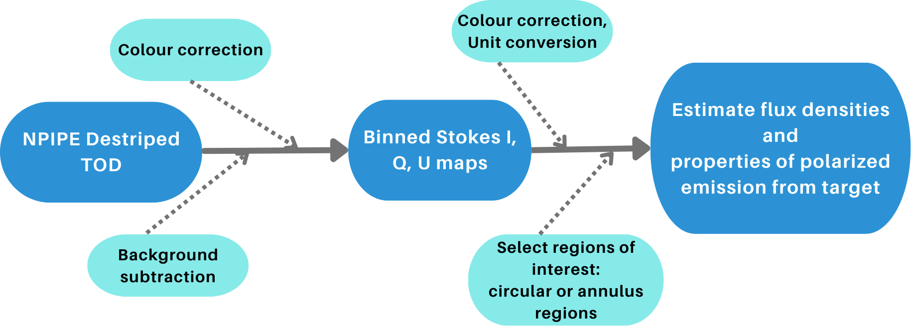

# crabpol 
This package contains the analysis tools for the processing of observations of the Crab nebula (also known as Tau-A or M1) by Planck (sub-mm wavelengths) and IXPE (X-ray wavelengths) satellites. Specifically, for the Planck data:
1) Procurement of NPIPE Time-Ordered Data (TOD)
2) Implementation of mapmaking methods: libmadam wrapper, binning in HealPix pixelization scheme, binning onto a square grid with user-defined number of pixels/pixel size
3) Computation of Unit Conversion (UC) and Colour Correction (CC) for a power-law SED and implementation of these corrections to NPIPE TOD using Planck RIMO files.
4) Conversions between different coordinate systems.
5) Visualisation tools to display Stokes I, Q, U maps of the object and an option to overplot polarization vectors.

And for the IXPE data:
1) Filtering of events within energy windows
2) Application of corrections with the ARF and MRF files
3) Map-making by binning the events onto a square grid (valid in flat-approximation)
4) Visualisation tools to display Stokes I, Q, U maps of the object and an option to overplot polarization vectors.


## Installation
- By cloning the repository:

``` </> Bash 
git clone https://github.com/Vyoma-M/crabpol.git
cd crabpol
pip install -e .
pip install -r requirements-dev.txt
```
This installs the package in editable mode.

## Test
Test your installation with:

``` 
cd crabpol
pytest
```
## Workflow
The basic order of functionalities for NPIPE TOD-processing and map-making (data reduction) are:

The most basic order of using the tools within this repo is (it is assumed that you have acquired the NPIPE TOD small datasets from the public archive):

1) Acquire the relevant columns of data from the FITS files of NPIPE TOD and assimilate them into the format for compatibility with other tools within the repository
2) Make binned maps from the acquired destriped TOD
3) Visualise the maps and estimate physical quantities of interest about the target such as flux densities, polarization degree and position angle of polarization in the presence of polarized emission (like polarized synchrotron emission in the case of Crab nebula)

#### On Colour Correction and background subtraction

The functionalities with broken arrows are optional and dependent on the target under study. This repository was developed for the analysis of the Crab nebula. We find from the observed flux densities in the sub-mm that it shows a power-law spectral profile with an index of -0.28. So one needs to compute colour correction for a power-law SED with index -0.28 and either apply them at the TOD level or at the map level. Similarly, background corrections can be first estimated by creating a binned map, selecting an annular region excluding target emission and obtaining an estimate of the flux in K_CMB units. This can then be applied at the TOD level before making maps.

Note: Applying colour correction also applies a unit conversion to MJy/sr.

#### On Map-making
Map-making is a data reduction method with the benefit of making pretty visualisations of the data. There are two options available for map-making:
1) Binning in [HEALPix](https://arxiv.org/abs/astro-ph/0409513) pixelization scheme
2) Binning on a square grid with user-defined pixel size and side length (in number of pixels) for small fields for which flat approximation applies

## Quick start
An example for a quick end-to-end map-making routine from NPIPE TOD:
```
from crabpol import Get_TOD, GetTODConfig, MapMaker 

# 1) Configure with variables of interest
cfg = GetTODConfig(
    instrument="HFI",  # High-frequency Instrument aboard Planck
    data_path=<path-to-TOD-directory>,
    freq=100, # in GHz
    nside=2048,
    withcc=False, # set to True if colour correction needs to be applied
    bg_subtraction=False, # set to True if background subtraction needs to be applied
)

# 2) Create a TOD loader with the above configuration
tod_loader = Get_TOD(config=cfg)

# 3) Create a MapMaker object with the TOD loader and desired map parameters
mm = MapMaker(tod_loader=tod_loader, npix=80, pixel_size=1.5)

# 4) Make a healpix map by binning the destriped TOD.
bmap = mm._bin_tod_healpix(freq=cfg.freq, nside=cfg.nside)
```
This routine takes the relevant data columns from the NPIPE TOD and bins them into maps with HEALPix pixelization scheme. The [examples](https://github.com/Vyoma-M/crabpol/tree/main/examples) folder contains more example routines for a demonstration of other functionalities within this repository.

## Contributing

Contributions are welcome! Please see [CONTRIBUTING.md](CONTRIBUTING.md) for guidelines on:
- Setting up a development environment
- Running tests and linters locally
- Making pull requests
- Code quality standards (black, isort, flake8, mypy)

For quick local setup:
```bash
pip install -e .
pip install -r requirements-dev.txt
pre-commit install
pytest
```

## Acknowledgement
If you found this package useful for your work, please cite my thesis:

Vyoma Muralidhara (2024): Spectral distortion and polarization of the cosmic microwave background: Measurement, challenges and perspectives, [DOI:10.5282/edoc.34768](https://arxiv.org/abs/2503.08538). 
BibTex entry:
```
@phdthesis{Muralidhara:2024hey,
    author = "Muralidhara, Vyoma",
    title = "{Spectral distortion and polarization of the cosmic microwave background}",
    eprint = "2503.08538",
    archivePrefix = "arXiv",
    primaryClass = "astro-ph.CO",
    doi = "10.5282/edoc.34768",
    school = "Munich U.",
    year = "2024"
}
```

## License

Copyright 2026 Vyoma Muralidhara.

crabpol is free software made available under the MIT License. For details see the LICENSE file.
